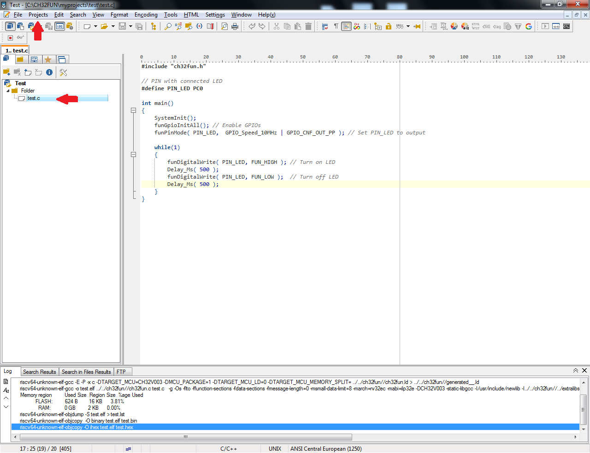
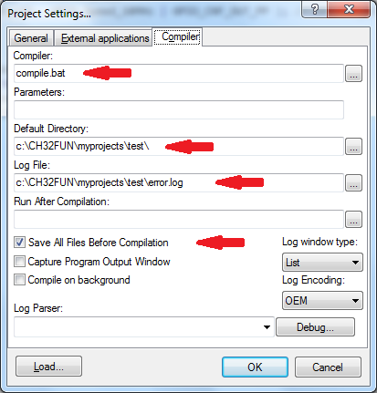
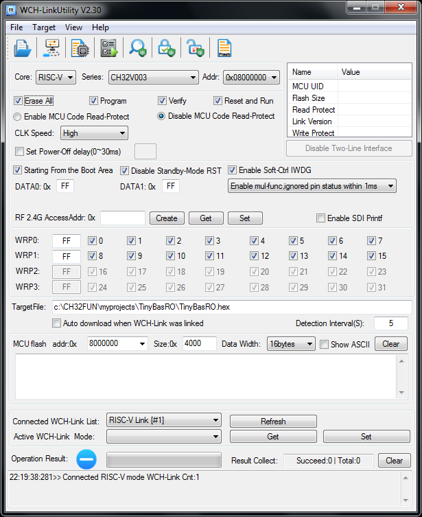

How to develop for CH32Vxxx in Windows
======================================

CH32V003 microcontrollers and similar types have become popular among professional and hobby electrical engineers due to their price and features. For program development, the manufacturer has prepared the MounRiver Studio, which is somewhat bulky and generates a slightly larger code thanks to its HAL. If you prefer smaller program packages or struggle with the size of the compiled code, you can use the ch32fun library.

The following procedure shows how this library can be used to create a simple environment for writing, compiling, and programming programs into these microcontrollers.

Images are used from TinyBasRO development!



Simple development environment for RISC-V CH32
----------------------------------------------

*   Get toolchain (compiler) for CH32V003 RISC-V processor
*   Set PATH variable to bin folder in Windows environment
*   Get ch32fun library
*   PsPad tool
*   Set PsPad environment
*   Get WCH-LinkUtility

Compiler for CH32V003 RISC-V processors
---------------------------------------
First, you will need a tool for compiling programs for RISC-V processors. The GCC compiler is among the proven and reliable ones, which can be found in several places. For CH32V003 processors, a smaller package is enough, which can be found here, for example [version GCC10](https://gnutoolchains.com/risc-v/). It is a little over 22 MB in size and when installing, place it in the C:\GCC_CH32 folder, for example.

Setting the PATH system variable
---------------------------------

In Windows, you need to set (add) a new PATH variable using the link in "Settings" -> "System" -> "Advanced system settings" that will point to the "bin" folder of the installed compiler package. For example:
C:\GCC_CH32\bin

ch32fun library
---------------

It is advisable to download the ch32fun library as a whole in .zip file format from [ch32fun](https://github.com/cnlohr/ch32fun). Then simply extract the zip file to a suitable folder - e.g. C:\CH32FUN.

Editor PSPad
------------
If you don't have your own favorite and used environment for writing programs, you can try PSPad. [PSPad editor](https://www.pspad.com/en/) is a freeware programmer's editor for MS Windows. Download and install it from the link provided (approx. 14 MB).

PSPad settings
--------------

Determine a working folder for your project. For example, in the CH32FUN folder, we will create a folder "myprojects" and another folder "test" inside it. In it, we will create 4 files using PSPad (or copy and edit them from the "examples" folders):

1) compile.bat - will contain text:

```
@ECHO OFF
REM Clean error.log file
IF EXIST error.log DEL error.log
REM Compile
make >> error.log 2>&1
```

2) funconfig.h - will contain text:

```
#ifndef _FUNCONFIG_H
#define _FUNCONFIG_H
// you can put various configurations in here, you can see a full list in ch32fun.h
// part selection is made in the Makefile
#endif
```

3) Makefile - will contain text (we will put the project name in the first line):

```
TARGET:=test
TARGET_MCU?=CH32V003
include ../../ch32fun/ch32fun.mk
clean : cv_clean
```

4) The source file test.c - will contain, for example, the blinking of the LED on PC0:

```
#include "ch32fun.h"

// PIN with connected LED
#define PIN_LED PC0

int main()
{
	SystemInit();
	funGpioInitAll(); // Enable GPIOs
	funPinMode( PIN_LED,  GPIO_Speed_10MHz | GPIO_CNF_OUT_PP ); // Set PIN_LED to output

	while(1)
	{
		funDigitalWrite( PIN_LED, FUN_HIGH ); // Turn on LED
		Delay_Ms( 500 );
		funDigitalWrite( PIN_LED, FUN_LOW );  // Turn off LED
		Delay_Ms( 500 );
	}
}
```
 
We will create a project in PSPad, where we will insert the file test.c as part of the project (in the folder on the left) and in the settings "Projects" -> "Project Settings" -> "Compiler" we will adjust the compiler settings as shown in the image:



Starting the compiler using the icon or the keyboard shortcut Ctrl+F9 should ensure that the program compiles without errors, with the amount of memory used listed in the bottom PSPad window. 

WCH-LinkUtility
---------------

If you have successfully compiled the program and obtained the .HEX file, all that remains is to load it into the microcontroller's memory.
Download and install (e.g. from the manufacturer's website) the WCH-LinkUtility program. You need the WCHLinkE programmer (the E at the end is important!). Connect the programmer to the processor using 3 wires (+Vdd, GND and SWIO). Then just select the microcontroller type, the .HEX file and select "Target" -> "Program" and the microcontroller should come to life...



Good luck working with RISC-V processors!
* * *

Jak vyvíjet programy pro CH32Vxxx ve Windows
============================================

Mikrořadiče CH32V003 a podobné typy se díky své ceně a svým vlastnostem staly populární mezi profesionálními i hobby elektrotechniky. Pro vývoj programů připravil výrobce prostředí MounRiver Studio, které je poněkud objemné a generuje díky svému HAL kód trochu rozsáhlejší. Pokud preferujete menší programové balíky nebo bojujete s velikostí přeloženého kódu, můžete sáhnout po knihovně ch32fun.

Následující postup ukazuje, jak lze tuto knihovnu použít a vytvořit si jednoduché prostředí pro psaní, překlad a naprogramování jednoduchých programů do těchto mikrořadičů.

Obrázky jsou použity z vývoje TinyBasRO!


Postup pro přípravu jednoduchého vývojového prostředí pro RISC-V CH32
---------------------------------------------------------------------

*   Stáhnout a nainstalovat nástrojový řetězec (překladač) pro CH32V003 RISC-V procesory
*   Nastavit proměnnou PATH na složku bin v prostředí Windows
*   Stáhnout a nainstalovat knihovnu ch32fun
*   Stáhnout a nainstalovat PSPad
*   Nastavit PsPad prostředí projektu
*   Stáhnout a nainstalovat WCH-LinkUtility

Překladač pro CH32V003 RISC-V procesory
---------------------------------------

Jako první budete potřebovat nástroj pro překlad programů pro RISC-V procesory. Mezi ověřené a spolehlivé se řadí GCC překladač, který jde nalézt na více místech. Pro procesory CH32V003 stačí menší balík, který najdete např. zde [verze GCC10](https://gnutoolchains.com/risc-v/). Je velký něco málo přes 22 MB a při instalaci jej umístěte např. do složky C:\GCC_CH32.

Nastavení systémové proměnné PATH
---------------------------------

Ve Windows je potřeba nastavit (přidat) pomocí odkazu v "Nastavení" -> "Systém" -> "Upřesnit nastavení systému" novou proměnnou PATH která bude ukazovat na složku bin instalovaného balíku s překladačem. Např.
C:\GCC_CH32\bin


edit the system PATH variable via "Advanced system settings" to add directories for command-line access

Knihovna ch32fun
----------------

Knihovnu ch32fun je vhodné stáhnout jako celek ve formátu .zip souboru z [ch32fun](https://github.com/cnlohr/ch32fun). Zip soubor pak stačí rozbalit do vhodné složky - např. C:\CH32FUN.

Editor PSPad
------------

Nemáte-li své vlastní oblíbené a používané prostředí pro psaní programu, můžete vyzkoušet PSPad. [PSPad editor](https://www.pspad.com/en/) je volně šiřitelný (freeware) univerzální editor pro MS Windows. Stáhněte a nainstalujte si jej z uvedeného odkazu (cca 14 MB).

PSPad is a freeware programmer's editor for Microsoft Windows operating systems.

Nastavení PSPad
---------------

Určete si pracovní složku pro svůj projekt. Např. ve složce CH32FUN vytvoříme složku "myprojects" a v ní další složku "test". Do ní vytvoříme pomocí PSPad (nebo zkopírujeme a upravíme ze složek "examples") 4 soubory:

1) compile.bat - bude obsahovat text:

```
@ECHO OFF
REM Clean error.log file
IF EXIST error.log DEL error.log
REM Compile
make >> error.log 2>&1
```

2) funconfig.h - bude obsahovat text:

```
#ifndef _FUNCONFIG_H
#define _FUNCONFIG_H
// you can put various configurations in here, you can see a full list in ch32fun.h
// part selection is made in the Makefile
#endif
```

3) Makefile - bude obsahovat text (v prvním řádku uvedeme jméno projektu):

```
TARGET:=test
TARGET_MCU?=CH32V003
include ../../ch32fun/ch32fun.mk
clean : cv_clean
```

4) Vlastní zdrojový soubor test.c - bude obsahovat např. blikání LED na PC0:

```
#include "ch32fun.h"

// PIN with connected LED
#define PIN_LED PC0

int main()
{
	SystemInit();
	funGpioInitAll(); // Enable GPIOs
	funPinMode( PIN_LED,  GPIO_Speed_10MHz | GPIO_CNF_OUT_PP ); // Set PIN_LED to output

	while(1)
	{
		funDigitalWrite( PIN_LED, FUN_HIGH ); // Turn on LED
		Delay_Ms( 500 );
		funDigitalWrite( PIN_LED, FUN_LOW );  // Turn off LED
		Delay_Ms( 500 );
	}
}
```
 
Vytvoříme si v PSPad projekt, u kterého vložíme soubor test.c jako součást projektu (do složky vlevo) a v nastavení "Projects" -> "Project Settings" -> "Compiler" upravíme nastavení kompilátoru podle obrázku:


Spuštění kompilátoru pomocí ikony nebo klávesové zkratky Ctrl+F9 by mělo zajistit přeložení programu bez chyb s vypsáním velikosti obsazené paměti ve spodním okně PSPad. 

WCH-LinkUtility
---------------

Jestliže máte úspěšně přeložený program a získali jste .HEX soubor, nezbývá než jej nahrát do paměti mikrořadiče.
Stáhněte si a nainstalujte (např. ze stránek výrobce) program WCH-LinkUtility. Potřebujete k němu programátor WCHLinkE (E na konci je důležité!). Propojte programátor s procesorem pomocí 3 vodičů (+Vdd, GND a SWIO). Pak již stačí vybrat typ mikrořadiče, .HEX soubor a zvolit "Target" -> "Program" a mikrořadič by měl ožít...


Hodně úspěchů při práci s RISC-V procesory!

